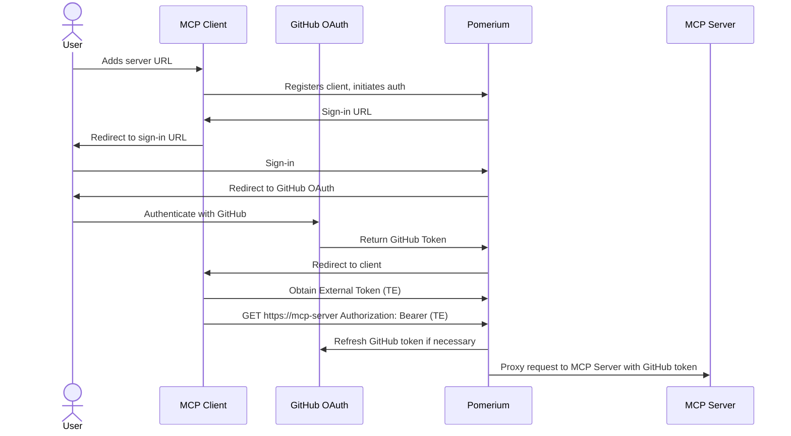

# GitHub MCP Server - HTTP Streamable Transport

> **This is a fork** of the [official GitHub MCP Server](https://github.com/github/github-mcp-server). The official version only supports stdio transport. This fork implements **HTTP streamable transport with per-request OAuth authentication** for self-hosted enterprise deployments.

## Why This Fork?

GitHub offers a closed-source hosted HTTP MCP server with OAuth, but it cannot be self-hosted. The official open-source server only supports stdio with single-user PATs. This fork bridges the gap by providing:

- **Self-Hosted HTTP + OAuth** - Get the benefits of GitHub's hosted server (HTTP transport, multi-user OAuth) while maintaining full control over your deployment
- **Multi-User Support** - Different users authenticate with their own GitHub credentials via OAuth
- **Zero-Trust Deployments** - Run behind proxies like Pomerium that handle OAuth flows and inject tokens per-request
- **Stateless Architecture** - No token storage or OAuth complexity in the MCP server; a proxy, like Pomerium manages all OAuth flows, token refresh, and sessions
- **Fine-Grained Authorization** - Pomerium policies can control access to individual MCP tools beyond OAuth scopes (e.g., allow `repo` scope but block `create_repository` tool)
- **Audit & Compliance** - Every GitHub API call is attributable to a specific authenticated user

## Architecture

This fork uses an external OAuth proxy (Pomerium) to handle authentication and inject GitHub OAuth tokens into each request:



The MCP server receives GitHub tokens from Pomerium and uses them to make API calls on behalf of authenticated users. All OAuth flows, token refresh, and session management happen in Pomerium - the MCP server is stateless.

---

## Quick Start

### Prerequisites

- Go 1.21+ (for building from source)
- A [GitHub OAuth App](https://docs.github.com/en/apps/oauth-apps/building-oauth-apps/creating-an-oauth-app) configured in your GitHub organization
- Pomerium or compatible OAuth proxy with [upstream OAuth support](https://www.pomerium.com/docs/capabilities/mcp#2-mcp-servers-with-upstream-oauth)

### Build from source

```bash
go build -o github-mcp-server ./cmd/github-mcp-server
./github-mcp-server http --listen :8080
```

**Important:** This server does NOT manage OAuth tokens. It requires an external OAuth proxy (like Pomerium) to:

1. **Handle GitHub OAuth flows** - Configure a GitHub OAuth App in your GitHub organization
2. **Manage token lifecycle** - Handle token acquisition, refresh, and expiration
3. **Inject tokens per-request** - Add `Authorization: Bearer <token>` headers to each request
4. **Manage user sessions** - Track user authentication state

The MCP server is purely a **stateless token consumer** - it receives tokens in request headers and uses them to call GitHub APIs. Unlike GitHub's closed-source remote server which manages tokens internally, this server delegates all token management to the gateway/proxy layer.

**Production deployment with Pomerium:**

Configure Pomerium with upstream OAuth to GitHub. See [Pomerium's MCP with Upstream OAuth guide](https://www.pomerium.com/docs/capabilities/mcp#2-mcp-servers-with-upstream-oauth) for complete setup instructions.

Example Pomerium route configuration:

```yaml
routes:
  - from: https://mcp.example.com
    to: http://github-mcp-server:8080

    # Pomerium handles GitHub OAuth and injects tokens
    upstream_oauth2:
      client_id: ${GITHUB_OAUTH_CLIENT_ID}
      client_secret: ${GITHUB_OAUTH_CLIENT_SECRET}
      scopes:
        - read:user
        - user:email
        - repo
        - read:org
      endpoint:
        auth_url: https://github.com/login/oauth/authorize
        token_url: https://github.com/login/oauth/access_token
```

### Docker Compose

```yaml
services:
  github-mcp:
    build:
      context: https://github.com/nickytonline/github-mcp-server.git
      dockerfile: Dockerfile
    pull_policy: always
    container_name: github-mcp
    restart: unless-stopped
    networks:
      - main

networks:
  main:
```

> **Note**: This example shows only the MCP server. You'll need to add Pomerium to the same compose file with the upstream OAuth configuration shown above. See [docs/pomerium-example.md](docs/pomerium-example.md) for a complete reference configuration with both services.

---

## Additional Documentation

For detailed information about specific features and deployment scenarios, see:

- **[blog.md](blog.md)** - Full technical explanation of the HTTP transport implementation and architecture
- **[docs/pomerium-example.md](docs/pomerium-example.md)** - Complete Pomerium integration guide for enterprise deployments
- **[Pomerium MCP Documentation](https://www.pomerium.com/docs/capabilities/mcp)** - Pomerium's official MCP support documentation
- **[MCP Security Best Practices](https://modelcontextprotocol.io/specification/2025-06-18/basic/security_best_practices)** - Model Context Protocol security guidelines

---

## Tool Configuration

This fork inherits all toolset configuration options from the official GitHub MCP Server. The server supports enabling or disabling specific groups of functionalities via the `--toolsets` flag. This allows you to control which GitHub API capabilities are available to your AI tools. Enabling only the toolsets that you need can help the LLM with tool choice and reduce the context size.

_Toolsets are not limited to Tools. Relevant MCP Resources and Prompts are also included where applicable._

### Available Toolsets

The following sets of tools are available (all are on by default):

<!-- START AUTOMATED TOOLSETS -->
| Toolset                 | Description                                                   |
| ----------------------- | ------------------------------------------------------------- |
| `context`               | **Strongly recommended**: Tools that provide context about the current user and GitHub context you are operating in |
| `actions` | GitHub Actions workflows and CI/CD operations |
| `code_security` | Code security related tools, such as GitHub Code Scanning |
| `dependabot` | Dependabot tools |
| `discussions` | GitHub Discussions related tools |
| `experiments` | Experimental features that are not considered stable yet |
| `gists` | GitHub Gist related tools |
| `issues` | GitHub Issues related tools |
| `notifications` | GitHub Notifications related tools |
| `orgs` | GitHub Organization related tools |
| `projects` | GitHub Projects related tools |
| `pull_requests` | GitHub Pull Request related tools |
| `repos` | GitHub Repository related tools |
| `secret_protection` | Secret protection related tools, such as GitHub Secret Scanning |
| `security_advisories` | Security advisories related tools |
| `users` | GitHub User related tools |
<!-- END AUTOMATED TOOLSETS -->

## Tools


<!-- START AUTOMATED TOOLS -->
<details>

<summary>Actions</summary>

- **cancel_workflow_run** - Cancel workflow run
  - `owner`: Repository owner (string, required)
  - `repo`: Repository name (string, required)
  - `run_id`: The unique identifier of the workflow run (number, required)

- **delete_workflow_run_logs** - Delete workflow logs
  - `owner`: Repository owner (string, required)
  - `repo`: Repository name (string, required)
  - `run_id`: The unique identifier of the workflow run (number, required)

- **download_workflow_run_artifact** - Download workflow artifact
  - `artifact_id`: The unique identifier of the artifact (number, required)
  - `owner`: Repository owner (string, required)
  - `repo`: Repository name (string, required)

- **get_job_logs** - Get job logs
  - `failed_only`: When true, gets logs for all failed jobs in run_id (boolean, optional)
  - `job_id`: The unique identifier of the workflow job (required for single job logs) (number, optional)
  - `owner`: Repository owner (string, required)
  - `repo`: Repository name (string, required)
  - `return_content`: Returns actual log content instead of URLs (boolean, optional)
  - `run_id`: Workflow run ID (required when using failed_only) (number, optional)
  - `tail_lines`: Number of lines to return from the end of the log (number, optional)

- **get_workflow_run** - Get workflow run
  - `owner`: Repository owner (string, required)
  - `repo`: Repository name (string, required)
  - `run_id`: The unique identifier of the workflow run (number, required)

- **get_workflow_run_logs** - Get workflow run logs
  - `owner`: Repository owner (string, required)
  - `repo`: Repository name (string, required)
  - `run_id`: The unique identifier of the workflow run (number, required)

- **get_workflow_run_usage** - Get workflow usage
  - `owner`: Repository owner (string, required)
  - `repo`: Repository name (string, required)
  - `run_id`: The unique identifier of the workflow run (number, required)

- **list_workflow_jobs** - List workflow jobs
  - `filter`: Filters jobs by their completed_at timestamp (string, optional)
  - `owner`: Repository owner (string, required)
  - `page`: Page number for pagination (min 1) (number, optional)
  - `perPage`: Results per page for pagination (min 1, max 100) (number, optional)
  - `repo`: Repository name (string, required)
  - `run_id`: The unique identifier of the workflow run (number, required)

- **list_workflow_run_artifacts** - List workflow artifacts
  - `owner`: Repository owner (string, required)
  - `page`: Page number for pagination (min 1) (number, optional)
  - `perPage`: Results per page for pagination (min 1, max 100) (number, optional)
  - `repo`: Repository name (string, required)
  - `run_id`: The unique identifier of the workflow run (number, required)

- **list_workflow_runs** - List workflow runs
  - `actor`: Returns someone's workflow runs. Use the login for the user who created the workflow run. (string, optional)
  - `branch`: Returns workflow runs associated with a branch. Use the name of the branch. (string, optional)
  - `event`: Returns workflow runs for a specific event type (string, optional)
  - `owner`: Repository owner (string, required)
  - `page`: Page number for pagination (min 1) (number, optional)
  - `perPage`: Results per page for pagination (min 1, max 100) (number, optional)
  - `repo`: Repository name (string, required)
  - `status`: Returns workflow runs with the check run status (string, optional)
  - `workflow_id`: The workflow ID or workflow file name (string, required)

- **list_workflows** - List workflows
  - `owner`: Repository owner (string, required)
  - `page`: Page number for pagination (min 1) (number, optional)
  - `perPage`: Results per page for pagination (min 1, max 100) (number, optional)
  - `repo`: Repository name (string, required)

- **rerun_failed_jobs** - Rerun failed jobs
  - `owner`: Repository owner (string, required)
  - `repo`: Repository name (string, required)
  - `run_id`: The unique identifier of the workflow run (number, required)

- **rerun_workflow_run** - Rerun workflow run
  - `owner`: Repository owner (string, required)
  - `repo`: Repository name (string, required)
  - `run_id`: The unique identifier of the workflow run (number, required)

- **run_workflow** - Run workflow
  - `inputs`: Inputs the workflow accepts (object, optional)
  - `owner`: Repository owner (string, required)
  - `ref`: The git reference for the workflow. The reference can be a branch or tag name. (string, required)
  - `repo`: Repository name (string, required)
  - `workflow_id`: The workflow ID (numeric) or workflow file name (e.g., main.yml, ci.yaml) (string, required)

</details>

<details>

<summary>Code Security</summary>

- **get_code_scanning_alert** - Get code scanning alert
  - `alertNumber`: The number of the alert. (number, required)
  - `owner`: The owner of the repository. (string, required)
  - `repo`: The name of the repository. (string, required)

- **list_code_scanning_alerts** - List code scanning alerts
  - `owner`: The owner of the repository. (string, required)
  - `ref`: The Git reference for the results you want to list. (string, optional)
  - `repo`: The name of the repository. (string, required)
  - `severity`: Filter code scanning alerts by severity (string, optional)
  - `state`: Filter code scanning alerts by state. Defaults to open (string, optional)
  - `tool_name`: The name of the tool used for code scanning. (string, optional)

</details>

<details>

<summary>Context</summary>

- **get_me** - Get my user profile
  - No parameters required

- **get_team_members** - Get team members
  - `org`: Organization login (owner) that contains the team. (string, required)
  - `team_slug`: Team slug (string, required)

- **get_teams** - Get teams
  - `user`: Username to get teams for. If not provided, uses the authenticated user. (string, optional)

</details>

<details>

<summary>Dependabot</summary>

- **get_dependabot_alert** - Get dependabot alert
  - `alertNumber`: The number of the alert. (number, required)
  - `owner`: The owner of the repository. (string, required)
  - `repo`: The name of the repository. (string, required)

- **list_dependabot_alerts** - List dependabot alerts
  - `owner`: The owner of the repository. (string, required)
  - `repo`: The name of the repository. (string, required)
  - `severity`: Filter dependabot alerts by severity (string, optional)
  - `state`: Filter dependabot alerts by state. Defaults to open (string, optional)

</details>

<details>

<summary>Discussions</summary>

- **get_discussion** - Get discussion
  - `discussionNumber`: Discussion Number (number, required)
  - `owner`: Repository owner (string, required)
  - `repo`: Repository name (string, required)

- **get_discussion_comments** - Get discussion comments
  - `after`: Cursor for pagination. Use the endCursor from the previous page's PageInfo for GraphQL APIs. (string, optional)
  - `discussionNumber`: Discussion Number (number, required)
  - `owner`: Repository owner (string, required)
  - `perPage`: Results per page for pagination (min 1, max 100) (number, optional)
  - `repo`: Repository name (string, required)

- **list_discussion_categories** - List discussion categories
  - `owner`: Repository owner (string, required)
  - `repo`: Repository name. If not provided, discussion categories will be queried at the organisation level. (string, optional)

- **list_discussions** - List discussions
  - `after`: Cursor for pagination. Use the endCursor from the previous page's PageInfo for GraphQL APIs. (string, optional)
  - `category`: Optional filter by discussion category ID. If provided, only discussions with this category are listed. (string, optional)
  - `direction`: Order direction. (string, optional)
  - `orderBy`: Order discussions by field. If provided, the 'direction' also needs to be provided. (string, optional)
  - `owner`: Repository owner (string, required)
  - `perPage`: Results per page for pagination (min 1, max 100) (number, optional)
  - `repo`: Repository name. If not provided, discussions will be queried at the organisation level. (string, optional)

</details>

<details>

<summary>Gists</summary>

- **create_gist** - Create Gist
  - `content`: Content for simple single-file gist creation (string, required)
  - `description`: Description of the gist (string, optional)
  - `filename`: Filename for simple single-file gist creation (string, required)
  - `public`: Whether the gist is public (boolean, optional)

- **list_gists** - List Gists
  - `page`: Page number for pagination (min 1) (number, optional)
  - `perPage`: Results per page for pagination (min 1, max 100) (number, optional)
  - `since`: Only gists updated after this time (ISO 8601 timestamp) (string, optional)
  - `username`: GitHub username (omit for authenticated user's gists) (string, optional)

- **update_gist** - Update Gist
  - `content`: Content for the file (string, required)
  - `description`: Updated description of the gist (string, optional)
  - `filename`: Filename to update or create (string, required)
  - `gist_id`: ID of the gist to update (string, required)

</details>

<details>

<summary>Issues</summary>

- **add_issue_comment** - Add comment to issue
  - `body`: Comment content (string, required)
  - `issue_number`: Issue number to comment on (number, required)
  - `owner`: Repository owner (string, required)
  - `repo`: Repository name (string, required)

- **add_sub_issue** - Add sub-issue
  - `issue_number`: The number of the parent issue (number, required)
  - `owner`: Repository owner (string, required)
  - `replace_parent`: When true, replaces the sub-issue's current parent issue (boolean, optional)
  - `repo`: Repository name (string, required)
  - `sub_issue_id`: The ID of the sub-issue to add. ID is not the same as issue number (number, required)

- **assign_copilot_to_issue** - Assign Copilot to issue
  - `issueNumber`: Issue number (number, required)
  - `owner`: Repository owner (string, required)
  - `repo`: Repository name (string, required)

- **create_issue** - Open new issue
  - `assignees`: Usernames to assign to this issue (string[], optional)
  - `body`: Issue body content (string, optional)
  - `labels`: Labels to apply to this issue (string[], optional)
  - `milestone`: Milestone number (number, optional)
  - `owner`: Repository owner (string, required)
  - `repo`: Repository name (string, required)
  - `title`: Issue title (string, required)
  - `type`: Type of this issue (string, optional)

- **get_issue** - Get issue details
  - `issue_number`: The number of the issue (number, required)
  - `owner`: The owner of the repository (string, required)
  - `repo`: The name of the repository (string, required)

- **get_issue_comments** - Get issue comments
  - `issue_number`: Issue number (number, required)
  - `owner`: Repository owner (string, required)
  - `page`: Page number for pagination (min 1) (number, optional)
  - `perPage`: Results per page for pagination (min 1, max 100) (number, optional)
  - `repo`: Repository name (string, required)

- **list_issue_types** - List available issue types
  - `owner`: The organization owner of the repository (string, required)

- **list_issues** - List issues
  - `after`: Cursor for pagination. Use the endCursor from the previous page's PageInfo for GraphQL APIs. (string, optional)
  - `direction`: Order direction. If provided, the 'orderBy' also needs to be provided. (string, optional)
  - `labels`: Filter by labels (string[], optional)
  - `orderBy`: Order issues by field. If provided, the 'direction' also needs to be provided. (string, optional)
  - `owner`: Repository owner (string, required)
  - `perPage`: Results per page for pagination (min 1, max 100) (number, optional)
  - `repo`: Repository name (string, required)
  - `since`: Filter by date (ISO 8601 timestamp) (string, optional)
  - `state`: Filter by state, by default both open and closed issues are returned when not provided (string, optional)

- **list_sub_issues** - List sub-issues
  - `issue_number`: Issue number (number, required)
  - `owner`: Repository owner (string, required)
  - `page`: Page number for pagination (default: 1) (number, optional)
  - `per_page`: Number of results per page (max 100, default: 30) (number, optional)
  - `repo`: Repository name (string, required)

- **remove_sub_issue** - Remove sub-issue
  - `issue_number`: The number of the parent issue (number, required)
  - `owner`: Repository owner (string, required)
  - `repo`: Repository name (string, required)
  - `sub_issue_id`: The ID of the sub-issue to remove. ID is not the same as issue number (number, required)

- **reprioritize_sub_issue** - Reprioritize sub-issue
  - `after_id`: The ID of the sub-issue to be prioritized after (either after_id OR before_id should be specified) (number, optional)
  - `before_id`: The ID of the sub-issue to be prioritized before (either after_id OR before_id should be specified) (number, optional)
  - `issue_number`: The number of the parent issue (number, required)
  - `owner`: Repository owner (string, required)
  - `repo`: Repository name (string, required)
  - `sub_issue_id`: The ID of the sub-issue to reprioritize. ID is not the same as issue number (number, required)

- **search_issues** - Search issues
  - `order`: Sort order (string, optional)
  - `owner`: Optional repository owner. If provided with repo, only issues for this repository are listed. (string, optional)
  - `page`: Page number for pagination (min 1) (number, optional)
  - `perPage`: Results per page for pagination (min 1, max 100) (number, optional)
  - `query`: Search query using GitHub issues search syntax (string, required)
  - `repo`: Optional repository name. If provided with owner, only issues for this repository are listed. (string, optional)
  - `sort`: Sort field by number of matches of categories, defaults to best match (string, optional)

- **update_issue** - Edit issue
  - `assignees`: New assignees (string[], optional)
  - `body`: New description (string, optional)
  - `duplicate_of`: Issue number that this issue is a duplicate of. Only used when state_reason is 'duplicate'. (number, optional)
  - `issue_number`: Issue number to update (number, required)
  - `labels`: New labels (string[], optional)
  - `milestone`: New milestone number (number, optional)
  - `owner`: Repository owner (string, required)
  - `repo`: Repository name (string, required)
  - `state`: New state (string, optional)
  - `state_reason`: Reason for the state change. Ignored unless state is changed. (string, optional)
  - `title`: New title (string, optional)
  - `type`: New issue type (string, optional)

</details>

<details>

<summary>Notifications</summary>

- **dismiss_notification** - Dismiss notification
  - `state`: The new state of the notification (read/done) (string, optional)
  - `threadID`: The ID of the notification thread (string, required)

- **get_notification_details** - Get notification details
  - `notificationID`: The ID of the notification (string, required)

- **list_notifications** - List notifications
  - `before`: Only show notifications updated before the given time (ISO 8601 format) (string, optional)
  - `filter`: Filter notifications to, use default unless specified. Read notifications are ones that have already been acknowledged by the user. Participating notifications are those that the user is directly involved in, such as issues or pull requests they have commented on or created. (string, optional)
  - `owner`: Optional repository owner. If provided with repo, only notifications for this repository are listed. (string, optional)
  - `page`: Page number for pagination (min 1) (number, optional)
  - `perPage`: Results per page for pagination (min 1, max 100) (number, optional)
  - `repo`: Optional repository name. If provided with owner, only notifications for this repository are listed. (string, optional)
  - `since`: Only show notifications updated after the given time (ISO 8601 format) (string, optional)

- **manage_notification_subscription** - Manage notification subscription
  - `action`: Action to perform: ignore, watch, or delete the notification subscription. (string, required)
  - `notificationID`: The ID of the notification thread. (string, required)

- **manage_repository_notification_subscription** - Manage repository notification subscription
  - `action`: Action to perform: ignore, watch, or delete the repository notification subscription. (string, required)
  - `owner`: The account owner of the repository. (string, required)
  - `repo`: The name of the repository. (string, required)

- **mark_all_notifications_read** - Mark all notifications as read
  - `lastReadAt`: Describes the last point that notifications were checked (optional). Default: Now (string, optional)
  - `owner`: Optional repository owner. If provided with repo, only notifications for this repository are marked as read. (string, optional)
  - `repo`: Optional repository name. If provided with owner, only notifications for this repository are marked as read. (string, optional)

</details>

<details>

<summary>Organizations</summary>

- **search_orgs** - Search organizations
  - `order`: Sort order (string, optional)
  - `page`: Page number for pagination (min 1) (number, optional)
  - `perPage`: Results per page for pagination (min 1, max 100) (number, optional)
  - `query`: Organization search query. Examples: 'microsoft', 'location:california', 'created:>=2025-01-01'. Search is automatically scoped to type:org. (string, required)
  - `sort`: Sort field by category (string, optional)

</details>

<details>

<summary>Projects</summary>

- **add_project_item** - Add project item
  - `item_id`: The numeric ID of the issue or pull request to add to the project. (number, required)
  - `item_type`: The item's type, either issue or pull_request. (string, required)
  - `owner`: If owner_type == user it is the handle for the GitHub user account. If owner_type == org it is the name of the organization. The name is not case sensitive. (string, required)
  - `owner_type`: Owner type (string, required)
  - `project_number`: The project's number. (number, required)

- **delete_project_item** - Delete project item
  - `item_id`: The internal project item ID to delete from the project (not the issue or pull request ID). (number, required)
  - `owner`: If owner_type == user it is the handle for the GitHub user account. If owner_type == org it is the name of the organization. The name is not case sensitive. (string, required)
  - `owner_type`: Owner type (string, required)
  - `project_number`: The project's number. (number, required)

- **get_project** - Get project
  - `owner`: If owner_type == user it is the handle for the GitHub user account. If owner_type == org it is the name of the organization. The name is not case sensitive. (string, required)
  - `owner_type`: Owner type (string, required)
  - `project_number`: The project's number (number, required)

- **get_project_field** - Get project field
  - `field_id`: The field's id. (number, required)
  - `owner`: If owner_type == user it is the handle for the GitHub user account. If owner_type == org it is the name of the organization. The name is not case sensitive. (string, required)
  - `owner_type`: Owner type (string, required)
  - `project_number`: The project's number. (number, required)

- **get_project_item** - Get project item
  - `item_id`: The item's ID. (number, required)
  - `owner`: If owner_type == user it is the handle for the GitHub user account. If owner_type == org it is the name of the organization. The name is not case sensitive. (string, required)
  - `owner_type`: Owner type (string, required)
  - `project_number`: The project's number. (number, required)

- **list_project_fields** - List project fields
  - `owner`: If owner_type == user it is the handle for the GitHub user account. If owner_type == org it is the name of the organization. The name is not case sensitive. (string, required)
  - `owner_type`: Owner type (string, required)
  - `per_page`: Number of results per page (max 100, default: 30) (number, optional)
  - `project_number`: The project's number. (number, required)

- **list_project_items** - List project items
  - `owner`: If owner_type == user it is the handle for the GitHub user account. If owner_type == org it is the name of the organization. The name is not case sensitive. (string, required)
  - `owner_type`: Owner type (string, required)
  - `per_page`: Number of results per page (max 100, default: 30) (number, optional)
  - `project_number`: The project's number. (number, required)
  - `query`: Search query to filter items (string, optional)

- **list_projects** - List projects
  - `owner`: If owner_type == user it is the handle for the GitHub user account. If owner_type == org it is the name of the organization. The name is not case sensitive. (string, required)
  - `owner_type`: Owner type (string, required)
  - `per_page`: Number of results per page (max 100, default: 30) (number, optional)
  - `query`: Filter projects by a search query (matches title and description) (string, optional)

- **update_project_item** - Update project item
  - `fields`: A list of field updates to apply. (array, required)
  - `item_id`: The numeric ID of the project item to update (not the issue or pull request ID). (number, required)
  - `owner`: If owner_type == user it is the handle for the GitHub user account. If owner_type == org it is the name of the organization. The name is not case sensitive. (string, required)
  - `owner_type`: Owner type (string, required)
  - `project_number`: The project's number. (number, required)

</details>

<details>

<summary>Pull Requests</summary>

- **add_comment_to_pending_review** - Add review comment to the requester's latest pending pull request review
  - `body`: The text of the review comment (string, required)
  - `line`: The line of the blob in the pull request diff that the comment applies to. For multi-line comments, the last line of the range (number, optional)
  - `owner`: Repository owner (string, required)
  - `path`: The relative path to the file that necessitates a comment (string, required)
  - `pullNumber`: Pull request number (number, required)
  - `repo`: Repository name (string, required)
  - `side`: The side of the diff to comment on. LEFT indicates the previous state, RIGHT indicates the new state (string, optional)
  - `startLine`: For multi-line comments, the first line of the range that the comment applies to (number, optional)
  - `startSide`: For multi-line comments, the starting side of the diff that the comment applies to. LEFT indicates the previous state, RIGHT indicates the new state (string, optional)
  - `subjectType`: The level at which the comment is targeted (string, required)

- **create_and_submit_pull_request_review** - Create and submit a pull request review without comments
  - `body`: Review comment text (string, required)
  - `commitID`: SHA of commit to review (string, optional)
  - `event`: Review action to perform (string, required)
  - `owner`: Repository owner (string, required)
  - `pullNumber`: Pull request number (number, required)
  - `repo`: Repository name (string, required)

- **create_pending_pull_request_review** - Create pending pull request review
  - `commitID`: SHA of commit to review (string, optional)
  - `owner`: Repository owner (string, required)
  - `pullNumber`: Pull request number (number, required)
  - `repo`: Repository name (string, required)

- **create_pull_request** - Open new pull request
  - `base`: Branch to merge into (string, required)
  - `body`: PR description (string, optional)
  - `draft`: Create as draft PR (boolean, optional)
  - `head`: Branch containing changes (string, required)
  - `maintainer_can_modify`: Allow maintainer edits (boolean, optional)
  - `owner`: Repository owner (string, required)
  - `repo`: Repository name (string, required)
  - `title`: PR title (string, required)

- **delete_pending_pull_request_review** - Delete the requester's latest pending pull request review
  - `owner`: Repository owner (string, required)
  - `pullNumber`: Pull request number (number, required)
  - `repo`: Repository name (string, required)

- **get_pull_request** - Get pull request details
  - `owner`: Repository owner (string, required)
  - `pullNumber`: Pull request number (number, required)
  - `repo`: Repository name (string, required)

- **get_pull_request_diff** - Get pull request diff
  - `owner`: Repository owner (string, required)
  - `pullNumber`: Pull request number (number, required)
  - `repo`: Repository name (string, required)

- **get_pull_request_files** - Get pull request files
  - `owner`: Repository owner (string, required)
  - `page`: Page number for pagination (min 1) (number, optional)
  - `perPage`: Results per page for pagination (min 1, max 100) (number, optional)
  - `pullNumber`: Pull request number (number, required)
  - `repo`: Repository name (string, required)

- **get_pull_request_review_comments** - Get pull request review comments
  - `owner`: Repository owner (string, required)
  - `pullNumber`: Pull request number (number, required)
  - `repo`: Repository name (string, required)

- **get_pull_request_reviews** - Get pull request reviews
  - `owner`: Repository owner (string, required)
  - `pullNumber`: Pull request number (number, required)
  - `repo`: Repository name (string, required)

- **get_pull_request_status** - Get pull request status checks
  - `owner`: Repository owner (string, required)
  - `pullNumber`: Pull request number (number, required)
  - `repo`: Repository name (string, required)

- **list_pull_requests** - List pull requests
  - `base`: Filter by base branch (string, optional)
  - `direction`: Sort direction (string, optional)
  - `head`: Filter by head user/org and branch (string, optional)
  - `owner`: Repository owner (string, required)
  - `page`: Page number for pagination (min 1) (number, optional)
  - `perPage`: Results per page for pagination (min 1, max 100) (number, optional)
  - `repo`: Repository name (string, required)
  - `sort`: Sort by (string, optional)
  - `state`: Filter by state (string, optional)

- **merge_pull_request** - Merge pull request
  - `commit_message`: Extra detail for merge commit (string, optional)
  - `commit_title`: Title for merge commit (string, optional)
  - `merge_method`: Merge method (string, optional)
  - `owner`: Repository owner (string, required)
  - `pullNumber`: Pull request number (number, required)
  - `repo`: Repository name (string, required)

- **request_copilot_review** - Request Copilot review
  - `owner`: Repository owner (string, required)
  - `pullNumber`: Pull request number (number, required)
  - `repo`: Repository name (string, required)

- **search_pull_requests** - Search pull requests
  - `order`: Sort order (string, optional)
  - `owner`: Optional repository owner. If provided with repo, only pull requests for this repository are listed. (string, optional)
  - `page`: Page number for pagination (min 1) (number, optional)
  - `perPage`: Results per page for pagination (min 1, max 100) (number, optional)
  - `query`: Search query using GitHub pull request search syntax (string, required)
  - `repo`: Optional repository name. If provided with owner, only pull requests for this repository are listed. (string, optional)
  - `sort`: Sort field by number of matches of categories, defaults to best match (string, optional)

- **submit_pending_pull_request_review** - Submit the requester's latest pending pull request review
  - `body`: The text of the review comment (string, optional)
  - `event`: The event to perform (string, required)
  - `owner`: Repository owner (string, required)
  - `pullNumber`: Pull request number (number, required)
  - `repo`: Repository name (string, required)

- **update_pull_request** - Edit pull request
  - `base`: New base branch name (string, optional)
  - `body`: New description (string, optional)
  - `draft`: Mark pull request as draft (true) or ready for review (false) (boolean, optional)
  - `maintainer_can_modify`: Allow maintainer edits (boolean, optional)
  - `owner`: Repository owner (string, required)
  - `pullNumber`: Pull request number to update (number, required)
  - `repo`: Repository name (string, required)
  - `reviewers`: GitHub usernames to request reviews from (string[], optional)
  - `state`: New state (string, optional)
  - `title`: New title (string, optional)

- **update_pull_request_branch** - Update pull request branch
  - `expectedHeadSha`: The expected SHA of the pull request's HEAD ref (string, optional)
  - `owner`: Repository owner (string, required)
  - `pullNumber`: Pull request number (number, required)
  - `repo`: Repository name (string, required)

</details>

<details>

<summary>Repositories</summary>

- **create_branch** - Create branch
  - `branch`: Name for new branch (string, required)
  - `from_branch`: Source branch (defaults to repo default) (string, optional)
  - `owner`: Repository owner (string, required)
  - `repo`: Repository name (string, required)

- **create_or_update_file** - Create or update file
  - `branch`: Branch to create/update the file in (string, required)
  - `content`: Content of the file (string, required)
  - `message`: Commit message (string, required)
  - `owner`: Repository owner (username or organization) (string, required)
  - `path`: Path where to create/update the file (string, required)
  - `repo`: Repository name (string, required)
  - `sha`: Required if updating an existing file. The blob SHA of the file being replaced. (string, optional)

- **create_repository** - Create repository
  - `autoInit`: Initialize with README (boolean, optional)
  - `description`: Repository description (string, optional)
  - `name`: Repository name (string, required)
  - `organization`: Organization to create the repository in (omit to create in your personal account) (string, optional)
  - `private`: Whether repo should be private (boolean, optional)

- **delete_file** - Delete file
  - `branch`: Branch to delete the file from (string, required)
  - `message`: Commit message (string, required)
  - `owner`: Repository owner (username or organization) (string, required)
  - `path`: Path to the file to delete (string, required)
  - `repo`: Repository name (string, required)

- **fork_repository** - Fork repository
  - `organization`: Organization to fork to (string, optional)
  - `owner`: Repository owner (string, required)
  - `repo`: Repository name (string, required)

- **get_commit** - Get commit details
  - `include_diff`: Whether to include file diffs and stats in the response. Default is true. (boolean, optional)
  - `owner`: Repository owner (string, required)
  - `page`: Page number for pagination (min 1) (number, optional)
  - `perPage`: Results per page for pagination (min 1, max 100) (number, optional)
  - `repo`: Repository name (string, required)
  - `sha`: Commit SHA, branch name, or tag name (string, required)

- **get_file_contents** - Get file or directory contents
  - `owner`: Repository owner (username or organization) (string, required)
  - `path`: Path to file/directory (directories must end with a slash '/') (string, optional)
  - `ref`: Accepts optional git refs such as `refs/tags/{tag}`, `refs/heads/{branch}` or `refs/pull/{pr_number}/head` (string, optional)
  - `repo`: Repository name (string, required)
  - `sha`: Accepts optional commit SHA. If specified, it will be used instead of ref (string, optional)

- **get_latest_release** - Get latest release
  - `owner`: Repository owner (string, required)
  - `repo`: Repository name (string, required)

- **get_release_by_tag** - Get a release by tag name
  - `owner`: Repository owner (string, required)
  - `repo`: Repository name (string, required)
  - `tag`: Tag name (e.g., 'v1.0.0') (string, required)

- **get_tag** - Get tag details
  - `owner`: Repository owner (string, required)
  - `repo`: Repository name (string, required)
  - `tag`: Tag name (string, required)

- **list_branches** - List branches
  - `owner`: Repository owner (string, required)
  - `page`: Page number for pagination (min 1) (number, optional)
  - `perPage`: Results per page for pagination (min 1, max 100) (number, optional)
  - `repo`: Repository name (string, required)

- **list_commits** - List commits
  - `author`: Author username or email address to filter commits by (string, optional)
  - `owner`: Repository owner (string, required)
  - `page`: Page number for pagination (min 1) (number, optional)
  - `perPage`: Results per page for pagination (min 1, max 100) (number, optional)
  - `repo`: Repository name (string, required)
  - `sha`: Commit SHA, branch or tag name to list commits of. If not provided, uses the default branch of the repository. If a commit SHA is provided, will list commits up to that SHA. (string, optional)

- **list_releases** - List releases
  - `owner`: Repository owner (string, required)
  - `page`: Page number for pagination (min 1) (number, optional)
  - `perPage`: Results per page for pagination (min 1, max 100) (number, optional)
  - `repo`: Repository name (string, required)

- **list_starred_repositories** - List starred repositories
  - `direction`: The direction to sort the results by. (string, optional)
  - `page`: Page number for pagination (min 1) (number, optional)
  - `perPage`: Results per page for pagination (min 1, max 100) (number, optional)
  - `sort`: How to sort the results. Can be either 'created' (when the repository was starred) or 'updated' (when the repository was last pushed to). (string, optional)
  - `username`: Username to list starred repositories for. Defaults to the authenticated user. (string, optional)

- **list_tags** - List tags
  - `owner`: Repository owner (string, required)
  - `page`: Page number for pagination (min 1) (number, optional)
  - `perPage`: Results per page for pagination (min 1, max 100) (number, optional)
  - `repo`: Repository name (string, required)

- **push_files** - Push files to repository
  - `branch`: Branch to push to (string, required)
  - `files`: Array of file objects to push, each object with path (string) and content (string) (object[], required)
  - `message`: Commit message (string, required)
  - `owner`: Repository owner (string, required)
  - `repo`: Repository name (string, required)

- **search_code** - Search code
  - `order`: Sort order for results (string, optional)
  - `page`: Page number for pagination (min 1) (number, optional)
  - `perPage`: Results per page for pagination (min 1, max 100) (number, optional)
  - `query`: Search query using GitHub's powerful code search syntax. Examples: 'content:Skill language:Java org:github', 'NOT is:archived language:Python OR language:go', 'repo:github/github-mcp-server'. Supports exact matching, language filters, path filters, and more. (string, required)
  - `sort`: Sort field ('indexed' only) (string, optional)

- **search_repositories** - Search repositories
  - `minimal_output`: Return minimal repository information (default: true). When false, returns full GitHub API repository objects. (boolean, optional)
  - `page`: Page number for pagination (min 1) (number, optional)
  - `perPage`: Results per page for pagination (min 1, max 100) (number, optional)
  - `query`: Repository search query. Examples: 'machine learning in:name stars:>1000 language:python', 'topic:react', 'user:facebook'. Supports advanced search syntax for precise filtering. (string, required)

- **star_repository** - Star repository
  - `owner`: Repository owner (string, required)
  - `repo`: Repository name (string, required)

- **unstar_repository** - Unstar repository
  - `owner`: Repository owner (string, required)
  - `repo`: Repository name (string, required)

</details>

<details>

<summary>Secret Protection</summary>

- **get_secret_scanning_alert** - Get secret scanning alert
  - `alertNumber`: The number of the alert. (number, required)
  - `owner`: The owner of the repository. (string, required)
  - `repo`: The name of the repository. (string, required)

- **list_secret_scanning_alerts** - List secret scanning alerts
  - `owner`: The owner of the repository. (string, required)
  - `repo`: The name of the repository. (string, required)
  - `resolution`: Filter by resolution (string, optional)
  - `secret_type`: A comma-separated list of secret types to return. All default secret patterns are returned. To return generic patterns, pass the token name(s) in the parameter. (string, optional)
  - `state`: Filter by state (string, optional)

</details>

<details>

<summary>Security Advisories</summary>

- **get_global_security_advisory** - Get a global security advisory
  - `ghsaId`: GitHub Security Advisory ID (format: GHSA-xxxx-xxxx-xxxx). (string, required)

- **list_global_security_advisories** - List global security advisories
  - `affects`: Filter advisories by affected package or version (e.g. "package1,package2@1.0.0"). (string, optional)
  - `cveId`: Filter by CVE ID. (string, optional)
  - `cwes`: Filter by Common Weakness Enumeration IDs (e.g. ["79", "284", "22"]). (string[], optional)
  - `ecosystem`: Filter by package ecosystem. (string, optional)
  - `ghsaId`: Filter by GitHub Security Advisory ID (format: GHSA-xxxx-xxxx-xxxx). (string, optional)
  - `isWithdrawn`: Whether to only return withdrawn advisories. (boolean, optional)
  - `modified`: Filter by publish or update date or date range (ISO 8601 date or range). (string, optional)
  - `published`: Filter by publish date or date range (ISO 8601 date or range). (string, optional)
  - `severity`: Filter by severity. (string, optional)
  - `type`: Advisory type. (string, optional)
  - `updated`: Filter by update date or date range (ISO 8601 date or range). (string, optional)

- **list_org_repository_security_advisories** - List org repository security advisories
  - `direction`: Sort direction. (string, optional)
  - `org`: The organization login. (string, required)
  - `sort`: Sort field. (string, optional)
  - `state`: Filter by advisory state. (string, optional)

- **list_repository_security_advisories** - List repository security advisories
  - `direction`: Sort direction. (string, optional)
  - `owner`: The owner of the repository. (string, required)
  - `repo`: The name of the repository. (string, required)
  - `sort`: Sort field. (string, optional)
  - `state`: Filter by advisory state. (string, optional)

</details>

<details>

<summary>Users</summary>

- **search_users** - Search users
  - `order`: Sort order (string, optional)
  - `page`: Page number for pagination (min 1) (number, optional)
  - `perPage`: Results per page for pagination (min 1, max 100) (number, optional)
  - `query`: User search query. Examples: 'john smith', 'location:seattle', 'followers:>100'. Search is automatically scoped to type:user. (string, required)
  - `sort`: Sort users by number of followers or repositories, or when the person joined GitHub. (string, optional)

</details>
<!-- END AUTOMATED TOOLS -->

### Additional Tools in Remote Github MCP Server

<details>

<summary>Copilot coding agent</summary>

-   **create_pull_request_with_copilot** - Perform task with GitHub Copilot coding agent
    -   `owner`: Repository owner. You can guess the owner, but confirm it with the user before proceeding. (string, required)
    -   `repo`: Repository name. You can guess the repository name, but confirm it with the user before proceeding. (string, required)
    -   `problem_statement`: Detailed description of the task to be performed (e.g., 'Implement a feature that does X', 'Fix bug Y', etc.) (string, required)
    -   `title`: Title for the pull request that will be created (string, required)
    -   `base_ref`: Git reference (e.g., branch) that the agent will start its work from. If not specified, defaults to the repository's default branch (string, optional)

</details>

<details>

<summary>Copilot Spaces</summary>

-   **get_copilot_space** - Get Copilot Space
    -   `owner`: The owner of the space. (string, required)
    -   `name`: The name of the space. (string, required)

-   **list_copilot_spaces** - List Copilot Spaces
</details>

#### Specifying Toolsets

To specify toolsets you want available to the LLM, you can pass an allow-list in two ways:

1. **Using Command Line Argument**:

   ```bash
   github-mcp-server --toolsets repos,issues,pull_requests,actions,code_security
   ```

2. **Using Environment Variable**:
   ```bash
   GITHUB_TOOLSETS="repos,issues,pull_requests,actions,code_security" ./github-mcp-server
   ```

The environment variable `GITHUB_TOOLSETS` takes precedence over the command line argument if both are provided.

### Using Toolsets With Docker

When using Docker, you can pass the toolsets as environment variables:

```bash
docker run -i --rm \
  -e GITHUB_TOOLSETS="repos,issues,pull_requests,actions,code_security,experiments" \
  <your-docker-image>
```

Note: This fork is designed to run behind an OAuth proxy like Pomerium. The MCP server itself does not require GitHub tokens directly - Pomerium injects them per-request.

### The "all" Toolset

The special toolset `all` can be provided to enable all available toolsets regardless of any other configuration:

```bash
./github-mcp-server --toolsets all
```

Or using the environment variable:

```bash
GITHUB_TOOLSETS="all" ./github-mcp-server
```

## Dynamic Tool Discovery

**Note**: This feature is currently in beta and may not be available in all environments. Please test it out and let us know if you encounter any issues.

Instead of starting with all tools enabled, you can turn on dynamic toolset discovery. Dynamic toolsets allow the MCP host to list and enable toolsets in response to a user prompt. This should help to avoid situations where the model gets confused by the sheer number of tools available.

> **Alternative with Pomerium**: Instead of using this hard-coded flag, you can use [Pomerium's dynamic authorization policies for MCP tools](https://www.pomerium.com/docs/capabilities/mcp#the-mcp_tool-criterion) to control tool access at a more granular level, including per-tool restrictions.

### Using Dynamic Tool Discovery

When using the binary, you can pass the `--dynamic-toolsets` flag.

```bash
./github-mcp-server --dynamic-toolsets
```

When using Docker, you can pass the toolsets as environment variables:

```bash
docker run -i --rm \
  -e GITHUB_DYNAMIC_TOOLSETS=1 \
  <your-docker-image>
```

## Read-Only Mode

To run the server in read-only mode, you can use the `--read-only` flag. This will only offer read-only tools, preventing any modifications to repositories, issues, pull requests, etc.

> **Alternative with Pomerium**: Instead of using this hard-coded flag, you can use [Pomerium's dynamic authorization policies](https://www.pomerium.com/docs/capabilities/mcp#authorization-policies) to control which tools are accessible on a per-user or per-group basis, offering more flexibility than a global read-only mode.

```bash
./github-mcp-server --read-only
```

When using Docker, you can pass the read-only mode as an environment variable:

```bash
docker run -i --rm \
  -e GITHUB_READ_ONLY=1 \
  <your-docker-image>
```

## GitHub Enterprise Server and Enterprise Cloud with data residency (ghe.com)

The flag `--gh-host` and the environment variable `GITHUB_HOST` can be used to set
the hostname for GitHub Enterprise Server or GitHub Enterprise Cloud with data residency.

- For GitHub Enterprise Server, prefix the hostname with the `https://` URI scheme, as it otherwise defaults to `http://`, which GitHub Enterprise Server does not support.
- For GitHub Enterprise Cloud with data residency, use `https://YOURSUBDOMAIN.ghe.com` as the hostname.
``` json
"github": {
    "command": "docker",
    "args": [
    "run",
    "-i",
    "--rm",
    "-e",
    "GITHUB_HOST",
    "<your-docker-image>"
    ],
    "env": {
        "GITHUB_HOST": "https://<your GHES or ghe.com domain name>"
    }
}
```

## i18n / Overriding Descriptions

The descriptions of the tools can be overridden by creating a
`github-mcp-server-config.json` file in the same directory as the binary.

The file should contain a JSON object with the tool names as keys and the new
descriptions as values. For example:

```json
{
  "TOOL_ADD_ISSUE_COMMENT_DESCRIPTION": "an alternative description",
  "TOOL_CREATE_BRANCH_DESCRIPTION": "Create a new branch in a GitHub repository"
}
```

You can create an export of the current translations by running the binary with
the `--export-translations` flag.

This flag will preserve any translations/overrides you have made, while adding
any new translations that have been added to the binary since the last time you
exported.

```sh
./github-mcp-server --export-translations
cat github-mcp-server-config.json
```

You can also use ENV vars to override the descriptions. The environment
variable names are the same as the keys in the JSON file, prefixed with
`GITHUB_MCP_` and all uppercase.

For example, to override the `TOOL_ADD_ISSUE_COMMENT_DESCRIPTION` tool, you can
set the following environment variable:

```sh
export GITHUB_MCP_TOOL_ADD_ISSUE_COMMENT_DESCRIPTION="an alternative description"
```

## Library Usage

The exported Go API of this module should currently be considered unstable, and subject to breaking changes. In the future, we may offer stability; please file an issue if there is a use case where this would be valuable.

## Comparison: This Fork vs. Official Servers

GitHub provides two official MCP server options:

1. **GitHub's Remote Server** (Closed-Source, Hosted) - Available at https:api.githubcopilot.com/mcp/, this is GitHub's official hosted HTTP MCP server with built-in OAuth support
2. **GitHub's Open-Source Server** - The [official open-source repository](https://github.com/github/github-mcp-server) supports stdio transport only for local development with Personal Access Tokens (PATs)

This fork provides an open-source HTTP alternative for self-hosted enterprise deployments:

| Feature | This Fork | Official Stdio Server | GitHub's Remote Server |
|---------|-----------|----------------------|------------------------|
| **Transport** | HTTP streamable | stdio only | HTTP |
| **Authentication** | OAuth (via external proxy) | PAT only | OAuth (built-in) |
| **Token Management** | External (Pomerium manages tokens) | N/A (static PAT) | Built-in (manages tokens) |
| **OAuth Provider** | External (Pomerium + GitHub OAuth App) | ❌ N/A | Built-in |
| **Multi-user** | ✅ Yes | ❌ No | ✅ Yes |
| **Self-hosted** | ✅ Yes | ✅ Yes | ❌ No |
| **Fine-grained authz** | ✅ Via Pomerium policies | ❌ No | ❌ No |
| **Open source** | ✅ Yes | ✅ Yes | ❌ No |

**Key Requirement:** You must create a [GitHub OAuth App](https://docs.github.com/en/apps/oauth-apps/building-oauth-apps/creating-an-oauth-app) in your GitHub organization and configure it in Pomerium's upstream OAuth settings.

## Contributing

This is a fork for demonstrating HTTP streamable transport with per-request OAuth. For issues with the core GitHub MCP functionality, please refer to the [official repository](https://github.com/github/github-mcp-server).

For issues specific to the HTTP transport implementation, feel free to open an issue in this repository.

## License

This project is licensed under the terms of the MIT open source license. Please refer to [MIT](./LICENSE) for the full terms.

## Acknowledgments

This fork builds upon the excellent work by the GitHub team on the [official GitHub MCP Server](https://github.com/github/github-mcp-server). The HTTP streamable transport additions demonstrate patterns for enterprise MCP deployments with OAuth-based multi-user authentication and fine-grained authorization.
